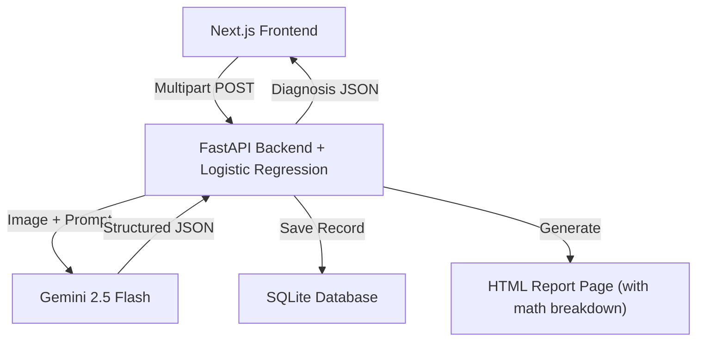

# OncoVision AI

Automated cancer cell detection and histopathological staging platform powered by multimodal LLM inference via Google Gemini 2.5 Flash, with deterministic confidence scoring using Logistic Regression.

> Built for the **Biology for Engineering** course.

---

## Architecture



## Features

- **AI-Powered Diagnosis** — Upload any H&E stained histopathology slide and receive a structured diagnostic readout in seconds. Works with any tissue type or condition — not limited to specific diseases.
- **Deterministic Confidence** — Uses a Logistic Regression model (not the LLM's guess) to calculate malignancy probability from three biomarkers.
- **Clinical Risk Labels** — Maps confidence to medical terms: *Definitive Malignancy*, *Highly Suspicious*, *Suspicious*, *Borderline Cancerous*, *Atypical / Precancerous*, *Benign / Normal*.
- **Mathematical Reasoning** — Every report includes a full step-by-step breakdown of the logistic regression calculation (z-score, sigmoid function, final probability).
- **Plain English Summary** — Non-medical readers get a jargon-free explanation of what each biomarker means.
- **Report History** — Every diagnosis is saved to a local SQLite database with the original image.
- **HTML Report Export** — View a professional clinical-grade report in a new tab with embedded image, biomarker table, math reasoning, case analysis, and disclaimer. Save as PDF via the browser's print dialog.
- **Automated Data Scraping** — `icrawler`-based script to gather proof-of-concept training images.

## Repository Structure

```
OncoVision/
├── backend/
│   ├── main.py                     # FastAPI — /predict, /history, /report/{id}/html
│   ├── database.py                 # SQLAlchemy ORM + SQLite persistence
│   ├── report.py                   # ReportLab PDF generator (legacy)
│   ├── scrape_training_images.py   # icrawler image scraper (3 categories)
│   ├── requirements.txt            # Python dependencies
│   ├── .env.example                # Environment variable template
│   └── data/                       # SQLite DB + uploaded images (gitignored)
│
├── frontend/
│   ├── src/app/
│   │   ├── page.tsx                # Diagnostic Dashboard (upload, results, history)
│   │   ├── globals.css             # Design system — minimalist tokens & animations
│   │   └── layout.tsx              # Root layout with Geist fonts + SEO
│   ├── package.json
│   └── tsconfig.json
│
├── .gitignore
└── README.md
```

## Tech Stack

| Layer            | Technology                                  |
| ---------------- | ------------------------------------------- |
| Frontend         | Next.js 16 (App Router), React 19, TypeScript |
| Styling          | Tailwind CSS 4                              |
| Backend          | FastAPI (Python 3.9+)                       |
| AI Engine        | Google GenAI SDK — Gemini 2.5 Flash         |
| Database         | SQLAlchemy + SQLite                         |
| Confidence Model | Logistic Regression (log-odds)              |
| Data Scraping    | icrawler (Bing source)                      |

## Confidence Calculation

Instead of relying on the LLM to hallucinate a confidence score, we use a **Logistic Regression** formula based on three morphological biomarkers:

```
P(Malignant) = 1 / (1 + e^(-z))

where z = -3.0  (baseline risk)
        + 3.0   (if N:C Ratio is High)
        + 2.0   (if Pleomorphism is Observed)
        + 2.0   (if Hyperchromasia is Detected)
```

| Markers Abnormal | z    | Confidence  | Risk Label              |
| ---------------- | ---- | ----------- | ----------------------- |
| 0 of 3           | -3.0 | 95.3% Benign | Benign / Normal         |
| 1 of 3 (secondary) | -1.0 | 73.1% Benign | Atypical / Precancerous |
| 1 of 3 (N:C Ratio) | 0.0  | 50.0%       | Borderline Cancerous    |
| 2 of 3           | 1.0–2.0 | 73.1–88.0% | Suspicious / Highly Suspicious |
| 3 of 3           | 4.0  | 98.2%       | Definitive Malignancy   |

## Setup

### 1. Backend

```bash
cd backend
python -m venv venv
source venv/bin/activate
pip install -r requirements.txt

# Set your Gemini API key
export GEMINI_API_KEY="your_key_here"

# Run the server
uvicorn main:app --reload --port 8000
```

### 2. Frontend

```bash
cd frontend
npm install
npm run dev
```

Open [http://localhost:3000](http://localhost:3000) in your browser.

### 3. Data Scraping (Optional)

```bash
cd backend
source venv/bin/activate
python scrape_training_images.py
```

Downloads ~20 H&E histology images per category into `backend/training_data/`.

## API Endpoints

### `POST /predict`

Upload a biopsy image for AI analysis. Returns structured diagnosis with deterministic confidence.

**Request:** Multipart form with `file` field (JPEG / PNG / WebP / TIFF).

**Response:**

```json
{
  "id": "a22759ae-d627-476f-996e-10cf1e941207",
  "prediction": "Invasive Ductal Carcinoma, Not Otherwise Specified",
  "confidence": 98.2,
  "risk_label": "Definitive Malignancy",
  "biological_indicators": {
    "nc_ratio": "High",
    "pleomorphism": "Observed",
    "hyperchromasia": "Detected"
  },
  "case_analysis": {
    "0_pathogenesis": "...",
    "1_clinical_features": "...",
    "2_radiographic_features": "...",
    "3_histologic_features": "...",
    "4_provisional_diagnosis": "...",
    "5_treatment_planning": "...",
    "6_potential_complications": "...",
    "7_transformation_probability": "..."
  }
}
```

### `GET /history`

Returns the most recent 50 diagnostic records (newest first).

### `GET /report/{id}/html`

Generates a styled HTML diagnostic report with embedded biopsy image, classification, biomarker table, step-by-step mathematical reasoning, and full case analysis.

## License

Academic use — Biology for Engineering coursework.
